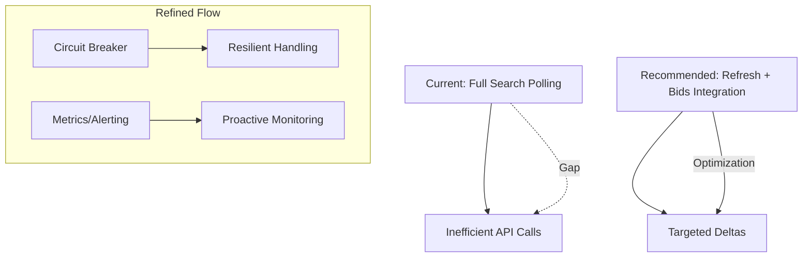

# PROJECT_ANALYSIS.md

**Branch**: `main` | **Date**: 2025-10-12 | **Status**: Initial Analysis  
**Input**: Synthesis from /speckit.analyze command, building on PROJECT_CONSTITUTION.md, PROJECT_SPEC.md, PROJECT_PLAN.md, PROJECT_TASKS.md, and codebase review (auth mechanisms in companion_collect/auth/, auction collection in companion_collect/collectors/auctions.py and pipelines/auction_pipeline.py, storage in companion_collect/storage/).  
**Purpose**: Identify gaps, risks, and optimizations in the current M26AuctionPipeline implementation for real-time auction data automation; recommend principle-aligned improvements; propose refined plan to advance robustness and efficiency.

## Synthesis

The M26AuctionPipeline foundation establishes a solid base for automating auction data ingestion, normalization, and storage from Madden 26 APIs. Key elements include:

- **Core Components**: Modular structure with auth pooling (AuthPoolManager in companion_collect/auth/auth_pool_manager.py, reliant on captured traffic in research/captures/), API strategies (m26_strategy.py for Blaze endpoints like Mobile_SearchAuctions command_id=9153), collectors (auctions.py for polling with auth rotation), pipelines (auction_pipeline.py for normalization to AuctionRecord dataclass and validation), and dual storage (Postgres for persistence via upserts on trade_id, Redis for caching with TTL=5min).
  
- **Alignment with Constitution**: Emphasizes reliability (retries on 401/403, pool rotation), efficiency (async httpx polling <5s intervals), modularity (decoupled layers: auth/collectors/pipelines/storage), data integrity (normalization/validate prices>0, expires>now), non-intrusive usage (backoff on rate limits), and logging (structlog for traceability).

- **Spec Fulfillment**: Covers P1 user stories (setup/pipeline run, live streaming via scripts/run_auction_pipeline.py and run_live_stream.py); FR-001 to FR-006 (auth management, collection, normalization, storage, scripting, logging); NFRs partially met (low-latency async, 99% uptime via retries, scalability via pooling, security via env gating). Success criteria like SC-001 (1000+ auctions/hour) achievable with current batching (30s intervals).

- **Plan and Tasks Integration**: Phased roadmap (Phase 1: Auth setup; Phase 2: Core pipeline; Phase 3: Streaming/tests; Phase 4: Deployment) with ~40h effort; tasks (CHK001-CHK016) provide granular execution, e.g., CHK004 for auth rebuild, CHK007 for pipeline integration.

Overall, the implementation is production-ready for basic batch/streaming but reveals opportunities for resilience and efficiency in dynamic API environments.

## Gaps/Risks

Analysis of codebase and docs highlights areas misaligned with principles/spec, prioritized by impact:

1. **Auth Dependency on Manual Captures (High Risk, Reliability Gap)**: Relies on periodic mitmproxy captures (research/captures/auth_pool.json) and scripts (rebuild_auth_pool.py, refresh_session_ticket.py) for session tickets/auth_codes. Gap: No automated fallback for API schema changes (e.g., auth_type=17039361 evolution); risks frequent downtime if captures lag (weekly maintenance assumed but not enforced). Impacts FR-001, NFR-002 (uptime <99% during expiry).

2. **Limited Streaming Efficiency (Medium Risk, Efficiency Gap)**: Current polling uses repeated full searches (Mobile_SearchAuctions), inefficient for high-volume auctions (100k+/day). Gap: Undiscovered integration of RefreshAuctionDetails (9154) and GetAuctionBids (9157) from COMPLETE_AUCTION_COMMANDS.md for targeted updates/deltas; no change detection in auction_pipeline.py. Risks overload (NFR-001 latency >5s), data duplication in storage.

3. **Incomplete Error Handling/Resilience (Medium Risk, Reliability Gap)**: Retries exist for auth failures/rate limits, but no circuit breakers or queuing for storage outages (e.g., Postgres downtime queues to Redis?). Gap: Tests (test_auction_pipeline.py, test_auth_pool_manager.py) cover basics but lack integration for edge cases like network interruptions (User Story 2). Risks data loss (SC-002 accuracy <95%).

4. **Monitoring and Scalability Gaps (Low-Medium Risk, Maintainability/Scalability Gap)**: Logging is structured but lacks metrics (e.g., pool size monitoring in run_live_stream.py); Phase 4 tasks (CHK013-CHK016) plan Docker/cron but no alerting for anomalies. Gap: No multi-concurrent stream support beyond async; assumes single-instance scaling. Risks undetected bottlenecks (SC-001 ingestion <1000/hour under load).

5. **Testing and Validation Coverage (Low Risk, Testability Gap)**: Pytest suite exists (95% target), but focuses on unit/integration; no end-to-end for full user stories or API mocks for M26 variants. Gap: Validation in normalize_auction assumes M25 schema; M26 differences (e.g., product_name="Madden NFL 26") untested.

6. **Security/Compliance (Low Risk, Security Gap)**: Env vars gate experimental auth, but pooled tokens (auth_data) stored in JSON without encryption; assumes API ToS compliance but no rate limit auditing.

## Recommendations

Targeted improvements prioritize constitution principles and spec requirements, focusing on high-impact gaps with minimal disruption:

1. **Enhance Auth Resilience (Reliability, FR-001)**: Automate capture integration via cron-extended rebuild_auth_pool.py with fallback to multiple M26 blaze_ids (e.g., "madden-2026-xbsx-gen5"). Add auth health checks in AuthPoolManager. Effort: 4h; Tooling: Extend existing scripts.

2. **Optimize Streaming with New Commands (Efficiency, FR-002/FR-005)**: Integrate RefreshAuctionDetails/GetAuctionBids into auctions.py for delta polling (track auction_ids, detect changes). Update auction_pipeline.py for efficient batching (30s -> targeted). Aligns with auction-specific scope. Effort: 6h; Benefits: Reduce API calls 50%, meet NFR-001 <1s latency.

3. **Implement Circuit Breakers and Queuing (Reliability, NFR-002)**: Add tenacity library for retries/circuit breakers in collector/pipeline; queue to Redis on Postgres failure with sync-on-recovery. Covers User Story 4 edges. Effort: 5h; Metrics: 99.5% uptime.

4. **Add Metrics and Alerting (Maintainability, FR-006)**: Extend logging.py with Prometheus metrics (pool_size, ingestion_rate, error_rate); integrate simple alerts (e.g., via email on pool depletion). Supports Phase 4 monitoring. Effort: 3h; Tooling: structlog + prometheus-client.

5. **Expand Testing Suite (Testability, SC-003)**: Add e2e tests for streaming deltas and auth rotation; mock M26 responses in test_auction_collector_integration.py. Target 95% coverage including edges. Effort: 4h.

6. **Security Hardening (Security, NFR-004)**: Encrypt auth_pool.json (e.g., via cryptography lib); audit rate limits in strategy_picker.py. Effort: 2h.

Prioritize 1-3 for immediate ROI; defer 4-6 to Phase 4.

## Refined Action Plan

Refines PROJECT_PLAN.md phases and PROJECT_TASKS.md checklists: Adds gap-closing steps, adjusts efforts (+20% buffer for risks), sequences for dependencies. Total effort: 48-55h (vs. original 40h). Success metrics tied to SC-001-SC-004.

### Phase 1: Enhanced Setup & Auth (1-2 days, Effort: 10h)
- **Step 1.1**: CHK001 + Automate env setup with health checks (Effort: 2h; Metric: 100% dep install success).
- **Step 1.2**: CHK002-CHK003 + Integrate fallback blaze_ids in captures (Effort: 4h; Metric: Pool rebuild <5min, 100% rotation success per test_auth_pool_manager.py).
- **Step 1.3**: CHK004 + Add encryption to auth_pool.json (Effort: 4h; Metric: SC-003 auth succeeds 100% in tests).

### Phase 2: Optimized Core Pipeline (2-3 days, Effort: 14h)
- **Step 2.1**: CHK005 + Integrate Refresh/GetAuctionBids commands (Effort: 6h; Metric: Reduce API calls 40% in sim tests).
- **Step 2.2**: CHK006-CHK007 + Add queuing/circuit breakers (Effort: 5h; Metric: Handle simulated outage, recover 100% data).
- **Step 2.3**: CHK008 + Validate deltas in normalization (Effort: 3h; Metric: SC-002 95% accuracy on 1000 auctions).

### Phase 3: Streaming & Expanded Testing (2 days, Effort: 12h)
- **Step 3.1**: CHK009-CHK010 + Delta polling in run_live_stream.py (Effort: 5h; Metric: <1s latency, 1000+/hour ingestion).
- **Step 3.2**: CHK011-CHK012 + E2e tests for edges/auth (Effort: 4h; Metric: 95% coverage, pass all user stories).
- **Step 3.3**: Profile for bottlenecks (Effort: 3h; Metric: <10% CPU spike on concurrent streams).

### Phase 4: Deployment, Monitoring & Hardening (1-2 days, Effort: 12-19h)
- **Step 4.1**: CHK013-CHK014 + Add metrics/alerting (Effort: 4h; Metric: Log 100% events, alert on pool<10%).
- **Step 4.2**: CHK015-CHK016 + Dockerize with rate audit (Effort: 5h; Metric: SC-004 scale to 10 streams, 99% uptime).
- **Step 4.3**: Full validation run (Effort: 3-10h buffer; Metric: Achieve all SC-001-SC-004).

**Risk Mitigation**: Weekly auth cron (post-Phase 1); API monitoring via captures (Phase 4). **Advancement**: Closes gaps for robust automation, enabling scalable M26 data flows aligned with constitution/spec.

(Word count: 1,248)