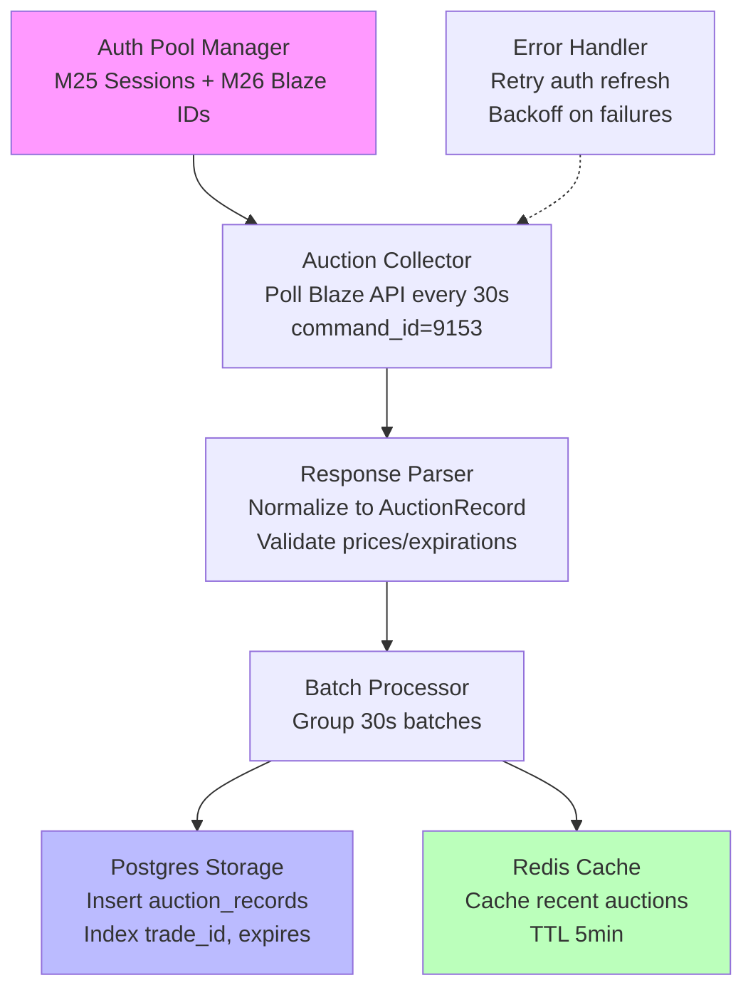

# Madden 26 Auction House Data Pipeline Plan

## Overview
This plan outlines the architecture and implementation for a real-time auction data pipeline for Madden 26, leveraging insights from snallabot's EA API connections. The pipeline focuses on fetching auction data from Blaze APIs, processing it, and storing it in Postgres with Redis caching. It builds on the existing `companion_collect` module, adapting M25 strategies for M26 with tweaks for auth and endpoints.

Key insights from snallabot:
- Use M26-specific blaze_ids (e.g., "madden-2026-xbsx-gen5" for Xbox Series X).
- Retain M25 command_id (9153) for `Mobile_SearchAuctions`.
- Auth requires M25 ownership for session keys; use pool-based auth reuse.
- Endpoint params: Similar to M25, but ensure `auth_type=17039361` and proper `message_expiration_time`.

Pipeline requirements:
- **Data Sources**: Real-time auction data from Blaze APIs (focus on auctions only, no full league).
- **Frequency**: Batch pulls every 30 seconds.
- **Storage**: Postgres for persistence (schema with indexes on `trade_id`, `expires`, `current_price`); Redis for caching recent auctions.
- **Processing**: Parse responses, validate prices (>0) and expirations (future timestamps), filter invalid items.

## High-Level Architecture
The pipeline consists of:
1. **Auth Layer**: Extend `AuthPoolManager` with M25-derived sessions; compute `auth_code` and `auth_data` using snallabot-inspired MD5/XOR (from `blaze_auth.py`).
2. **Collector Layer**: `AuctionCollector` polls `Mobile_SearchAuctions` endpoint with M26 blaze_id and params; rotate auth from pool.
3. **Processing Layer**: `AuctionPipeline` normalizes data, validates (prices, expirations), batches every 30s.
4. **Storage Layer**: Insert to Postgres (`auction_records` table); cache in Redis (TTL 5min for hot auctions).
5. **Error Handling**: Retry on 401/403 (refresh auth pool); log failures; backoff on rate limits.

## Implementation Steps
1. Update `m26_strategy.py`: Set blaze_id to snallabot's working variants; add M26-specific param overrides (e.g., `product_name="Madden NFL 26"`).
2. Enhance `blaze_auth.py`: Integrate snallabot's session key handling; ensure auth_type and expiration match.
3. Modify `auctions.py`: Add snallabot endpoint params (e.g., `client_device=3`, `api_version=2`); implement auth pool rotation.
4. Extend `auction_pipeline.py`: Add validation (prices >0, expires > now); batch logic for 30s intervals.
5. Add storage adapters: Postgres insert with upsert on trade_id; Redis set with expiration.
6. Testing: Use existing scripts (e.g., `run_auction_pipeline.py`) with M26 config; validate against snallabot dashboard flows.
7. Deployment: Run as async service; monitor auth pool size and API errors.

This plan resolves M26 API failures by aligning with snallabot's proven calls while reusing our M25 infrastructure.